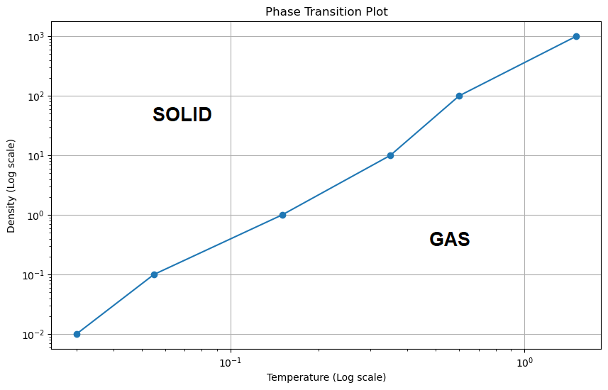

# Monte Carlo Methods project

last_version --> code for the MC simulations

The relevant results, where I analized the phase transitions are in 
the 10000it folder. Inside, it is organized the following way:

-Annealing: the results of the annealing simulations for two cooling
retes (0.99 and 0.999)
-Examples: the pair distribution functions and particle position plots
for ordered lattice and a body with random particle positions
-Results_densities: the relevant simulations for different densities.
Within each density folder, there are position plots and pair distribution
function plos for several temperatures. There also is a text file including
the enrgy of each system in ordered temperature (from low to high)

The other two folders just include more simulations take through the project 
but without major use

## Results 

I finally got the following results:

